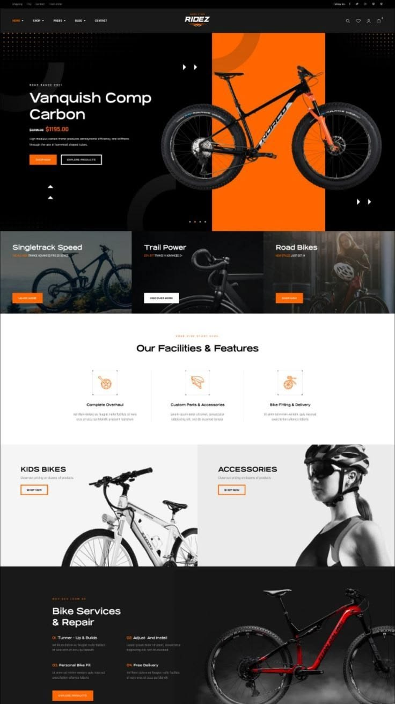
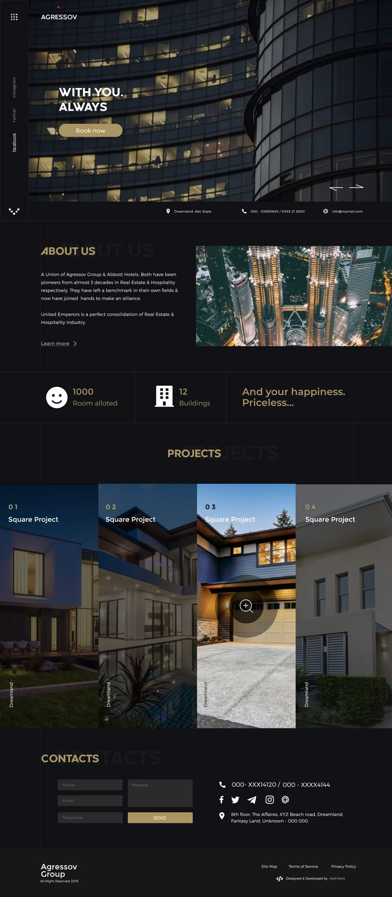

# Notas — Color Palette

### ridez-dark-orange.jpeg (PRECISA SER ADICIONADO MANUALMENTE nesta pasta)
**Site:** Ridez — bike shop
**O que gostei:** Prova de que dark + orange accent funciona em escala completa.
**Quero usar:** Apenas como validação de cor. Dark + warm accent cria sensação premium.

### agressov.jpeg (PRECISA SER ADICIONADO MANUALMENTE nesta pasta)
**Site:** Agressov Group — dark real estate
**O que gostei:** Dark + gold/amber accent. Sensação premium e quente.
**Quero usar:** Substituir gold por Journey Orange (#E8622A) — mesmo princípio.

Princípios do Brand Manual:
- Journey Orange (#E8622A) ativa UM elemento por composição — nunca decora
- Warm White (#F5F0E8) para backgrounds claros — nunca cold white (#FFFFFF)
- Paleta A (warm earth) deve representar 70%+ do uso total de cor

